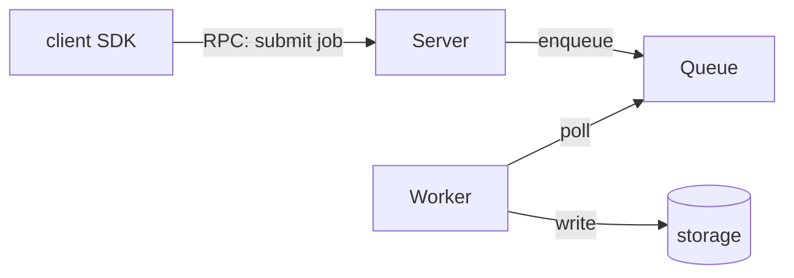
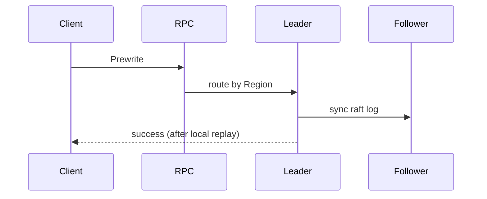
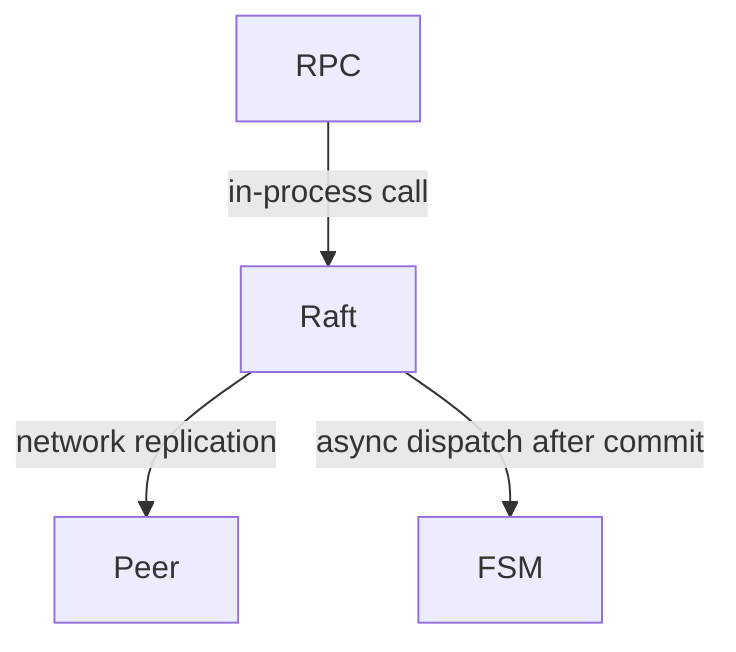
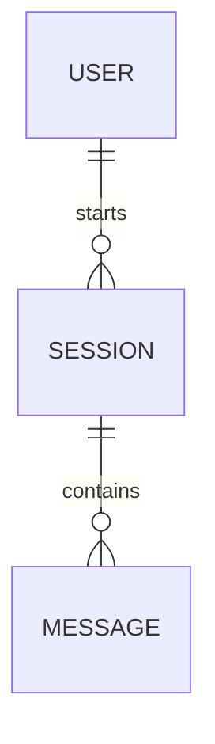

# Show Me

Invoked as `/show-me <description>`. Produce a **visual-first** explanation: a
minimal set of sketches, each next to the short text it supports. Skip
pleasantries — the sketches carry the explanation; the text only frames them.

Empty description → ask one short question. Ambiguous → state your reading in
one sentence and proceed.

## Definitions

An explanation may draw on these terms:

- **node** — a complete process. It may expose interfaces over RPC, HTTP, etc.
- **channel** — the exchange between two nodes (RPC, queue, shared storage…).
  A channel may carry control traffic — one node directing another, a lease
  renewing — or IO traffic — the data itself. Knowing what flows over each
  channel is central to understanding the system.
- **flow** — one request handled end to end: an IO request being served, a
  create-filesystem call being carried out. A flow may complete inside one
  node or pass through several. Two forms:
  - **sync** — the response carries a definite final state; analysis just
    follows the code step by step.
  - **async** — handled in segments: the response may report only an
    intermediate state ("creating"), with internal events driving the rest;
    analysis must trace what triggers each continuation, to its logical end.
- **module** — a building block inside a node. A single storage-service node
  may consist of a metadata module and a data module.
- **layer** — a level inside a node. A storage node's top layer may be the
  protocol entry (RPC), the middle its metadata and data processing modules,
  the bottom its storage — a local filesystem or raw disk.
- **architecture** — one system drawn as its nodes and channels. The labeled
  channels make each exchange visible — who controls whom, where the data
  goes — so the reader grasps the overall shape at a glance. Modules and
  layers enter the picture when the question zooms into one node.

Rules for drawing an architecture diagram:

- each node named plainly (SDK, client, server, scheduler…), with one line of
  responsibility
- each channel edge labeled with how the two nodes talk (RPC, queue, shared
  storage…) and the direction; when you know what flows over the channel —
  control or data — put it on the edge or in the text below
- facts that don't fit in the diagram: mark the spot with a short annotation
  and explain it under the diagram



## Pick the shape

| Shape | Question sounds like | Default rendering |
|---|---|---|
| Flow | "how does X work", "what happens when…" | call tree or mermaid diagram — whichever fits the flow |
| Architecture | "architecture of X" | node-and-channel graph |
| Code organization | "how is X organized", "what modules exist" | mermaid component diagram or annotated file tree |
| Logic | "explain this algorithm/function" | branch narrative |
| Change | "what does this PR do", "before vs after" | diff of the existing shape |
| Concept | "what is X in this codebase" | small map + one example flow |
| Data model | "how is the data stored", "schema/layout of X" | erDiagram for a database schema; plain-text box layout for an on-disk format or in-memory structure |

Flow vs. logic: if answering requires naming a **second ownership boundary**
(another module, process, or async continuation), it's a flow — render the
participants and boundary crossings. If the difficulty is one unit's internal
branches, it's logic — render the decisions.

Narrow question → explore and explain in one pass. Wide question (a subsystem,
the whole repo) → dispatch 2–4 exploration subagents in parallel, one angle
each; ask for nodes with responsibilities and connections, not code dumps.

## Explore

Read real code: judgments rest only on implementations actually read; file
names and READMEs are locating clues. Start from landmarks — manifests, entry
points, route/handler registrations, symbols named in the request. Follow the
thread from trigger to outcome until you can state every step without hedging.
Record the traps a newcomer would hit: hidden coupling, surprising ownership.

## Compose

Skeleton, in order: one-line conclusion → main view → short interpretation
hugging the view → references (`Class::method` + file) → uncertainty flags if
any. At most one supplementary view, only when another angle is needed.

Keep only details that serve the question: who executes, who owns state, where
boundaries are crossed, where it waits. When the flow leans on a well-known
mechanism (e.g. Raft), declare it in one opening sentence and then reference it
compressed — the main line carries only this code's own logic.

## Renderings

Logic or algorithm — branch narrative, plain language, one line per decision:

```text
on(save)
  if content unchanged
    return cached result       # early return: no side effects
  write new content
  if write failed
    return error               # cache untouched
  invalidate old cache
```

Flow within one process — call tree:

```text
submitForm
  createSession
    persistPrompt
    launchAgent
  navigateToSession
```

Flow across boundaries — mermaid sequence diagram, every edge a verb:



Async flows must show: where the request returns, what was persisted before
return, what triggers each continuation, and the logical completion condition.

Code organization — mermaid component diagram or annotated shallow file tree:



```text
src/
├── commands/   # parses user actions
├── sessions/   # owns session state
└── transport/  # syncs to the server
```

Data model — mermaid erDiagram, plus a small table (entity / defined at / key
fields / referenced by):



On-disk format or in-memory structure — plain-text box layout, stacked
vertically or side by side, whichever fits:

```text
+--------------------------+
| magic              (4B)  |
+--------------------------+
| version            (2B)  |
+--------------------------+
| inode count        (4B)  |
+--------------------------+
```

Change — diff of the surrounding shape, when it already exists:

```diff
 on(save)
+  if content unchanged
+    return cached result
   write new content
+  invalidate old cache
```

Full block — most of the shape is new, or the user needs a copyable target.
For a visual too dense for mermaid (UI, layout, state comparison), write one
focused HTML file and open it.

## Rules

- ≤10 nodes per view; split overflow into multiple views, don't cram
- every edge gets a verb label ("triggers" / "reads" / "writes"); inferred
  edges dashed or marked `?`
- labels in plain language; symbol names live in the references
- references use stable symbols + file (`Class::method`, file); line numbers
  only when asked
- README/comment claims checked against implementation; discrepancies noted
