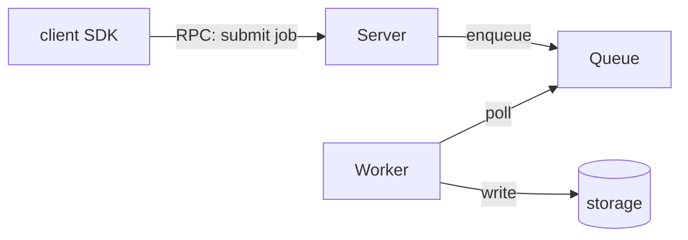
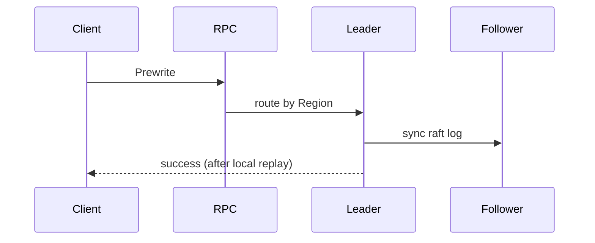
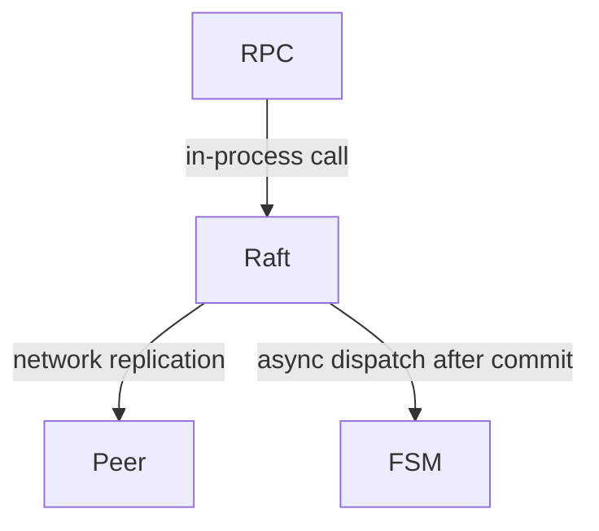
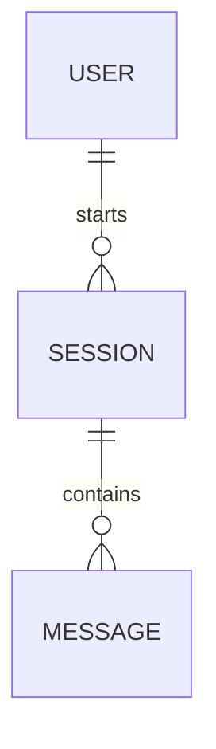

# System Views

A shared language for describing a system: a fixed vocabulary, the
decomposition it implies, and the rendering each kind of view defaults to.
This skill carries no task workflow of its own — the task that loaded it
(explaining, designing, reviewing) supplies the process. The terms are
context-neutral: they describe a system whether it already exists or is
only proposed.

## Definitions

- **node** — a complete process. It may expose interfaces over RPC, HTTP, etc.
- **channel** — the exchange between two nodes (RPC, queue, shared storage…).
  A channel may carry control traffic — one node directing another, a lease
  renewing — or IO traffic — the data itself.
- **flow** — one request handled end to end: an IO request being served, a
  create-filesystem call being carried out. A flow may complete inside one
  node or pass through several. Two forms:
  - **sync** — the response carries a definite final state; the view just
    follows the steps in order.
  - **async** — handled in segments: the response may report only an
    intermediate state ("creating"), with later events driving the rest; the
    view must trace what triggers each continuation, to its logical end.
- **module** — a building block inside a node. A single storage-service node
  may consist of a metadata module and a data module.
- **layer** — a level inside a node. A storage node's top layer may be the
  protocol entry (RPC), the middle its metadata and data processing modules,
  the bottom its storage — a local filesystem or raw disk.
- **architecture** — one system drawn as its nodes and channels. Labeled
  channels make each exchange visible — who controls whom, where the data
  goes — so the overall shape reads at a glance. Modules and layers enter
  the picture when the view zooms into one node.

Rules for drawing an architecture diagram:

- each node named plainly (SDK, client, server, scheduler…), with one line of
  responsibility
- each channel edge labeled with the protocol (RPC, queue, shared storage…)
  and the direction; mark what flows over it — control or data — on the edge
  or in the text below
- facts that don't fit in the diagram: mark the spot with a short annotation
  and explain it under the diagram



## Decomposition

Use the definitions as a method: decompose a system by finding which term
each of its parts falls under — a part's position in the vocabulary is its
role in the system. The terms also name the moves available on a system —
split a node, add a channel, turn a sync flow async, insert a layer.

## Renderings

Logic or algorithm — branch narrative, plain language, one line per decision:

```text
on(save)
  if content unchanged
    return cached result       # early return: no side effects
  write new content
  if write failed
    return error               # cache untouched
  invalidate old cache
```

Flow within one process — call tree:

```text
submitForm
  createSession
    persistPrompt
    launchAgent
  navigateToSession
```

Flow across boundaries — mermaid sequence diagram, every edge a verb:



Async flows must show: where the request returns, what was persisted before
return, what triggers each continuation, and the logical completion condition.

Code organization — mermaid component diagram or annotated shallow file tree:



```text
src/
├── commands/   # parses user actions
├── sessions/   # owns session state
└── transport/  # syncs to the server
```

Data model — mermaid erDiagram, plus a small table (entity / defined at / key
fields / referenced by):



On-disk format or in-memory structure — plain-text box layout, stacked
vertically or side by side, whichever fits:

```text
+--------------------------+
| magic              (4B)  |
+--------------------------+
| version            (2B)  |
+--------------------------+
| inode count        (4B)  |
+--------------------------+
```

Change — diff of the surrounding shape, when it already exists:

```diff
 on(save)
+  if content unchanged
+    return cached result
   write new content
+  invalidate old cache
```

Full block — most of the shape is new, or the reader needs a copyable target.
For a visual too dense for mermaid (UI, layout, state comparison), write one
focused HTML file and open it.

## Rules

- ≤10 nodes per view; split overflow into multiple views, don't cram
- no self-call edges in sequence diagrams: internal steps (checks, applies)
  fold into the incoming edge's label or the text below
- omit protocol machinery and pure ack/reply edges (acks, quorum, retries);
  the view shows who does what. Keep a reply edge only when the response
  carries state the reader needs
- every edge gets a verb label ("triggers" / "reads" / "writes"); inferred
  edges dashed or marked `?`
- labels in plain language; symbol names live in the references
- references use stable symbols + file (`Class::method`, file); line numbers
  only when asked

## Mechanism references

A node may lean on a well-known mechanism. When one appears, load the
matching reference before drawing or reasoning about its flows:

- Raft — placement (single-raft vs multi-raft) and flow patterns (who acts
  after replication; failover through replicated handles):
  `reference/raft.md`
